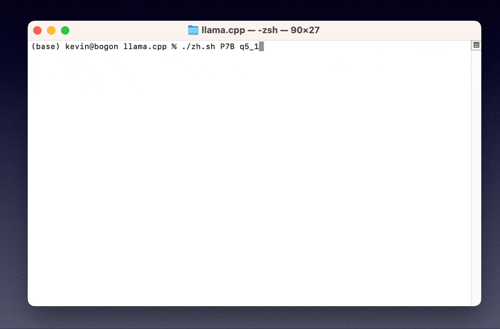
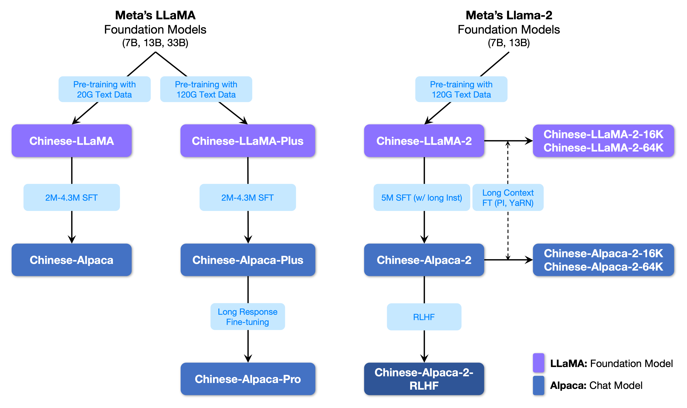

# [Chinese-LLaMA-Alpaca-3](https://github.com/ymcui/Chinese-LLaMA-Alpaca-3)项目启动！

[**🇨🇳中文**](./README.md) | [**🌐English**](./README_EN.md) | [**📖文档/Docs**](https://github.com/ymcui/Chinese-LLaMA-Alpaca/wiki) | [**❓提问/Issues**](https://github.com/ymcui/Chinese-LLaMA-Alpaca/issues) | [**💬讨论/Discussions**](https://github.com/ymcui/Chinese-LLaMA-Alpaca/discussions) | [**⚔️竞技场/Arena**](http://llm-arena.ymcui.com/)

<p align="center">
    <br>
    
    <br>
</p>
<p align="center">
    
    
    
    
    <a href="https://app.codacy.com/gh/ymcui/Chinese-LLaMA-Alpaca/dashboard?utm_source=gh&utm_medium=referral&utm_content=&utm_campaign=Badge_grade"></a>
</p>


本项目开源了**中文LLaMA模型和指令精调的Alpaca大模型**，以进一步促进大模型在中文NLP社区的开放研究。这些模型**在原版LLaMA的基础上扩充了中文词表**并使用了中文数据进行二次预训练，进一步提升了中文基础语义理解能力。同时，中文Alpaca模型进一步使用了中文指令数据进行精调，显著提升了模型对指令的理解和执行能力。

**技术报告（V2）**：[[Cui, Yang, and Yao] Efficient and Effective Text Encoding for Chinese LLaMA and Alpaca](https://arxiv.org/abs/2304.08177)

**本项目主要内容：**

- 🚀 针对原版LLaMA模型扩充了中文词表，提升了中文编解码效率 
- 🚀 开源了使用中文文本数据预训练的中文LLaMA以及经过指令精调的中文Alpaca
- 🚀 开源了预训练脚本、指令精调脚本，用户可根据需要进一步训练模型
- 🚀 快速使用笔记本电脑（个人PC）的CPU/GPU本地量化和部署体验大模型
- 🚀 支持[🤗transformers](https://github.com/huggingface/transformers), [llama.cpp](https://github.com/ggerganov/llama.cpp), [text-generation-webui](https://github.com/oobabooga/text-generation-webui), [LlamaChat](https://github.com/alexrozanski/LlamaChat), [LangChain](https://github.com/hwchase17/langchain), [privateGPT](https://github.com/imartinez/privateGPT)等生态
- 目前已开源的模型版本：7B（基础版、**Plus版**、**Pro版**）、13B（基础版、**Plus版**、**Pro版**）、33B（基础版、**Plus版**、**Pro版**）

💡 下图是中文Alpaca-Plus-7B模型在本地CPU量化部署后的实际体验速度和效果。



----

[**中文LLaMA-2&Alpaca-2大模型**](https://github.com/ymcui/Chinese-LLaMA-Alpaca-2) | [多模态中文LLaMA&Alpaca大模型](https://github.com/airaria/Visual-Chinese-LLaMA-Alpaca) | [多模态VLE](https://github.com/iflytek/VLE) | [中文MiniRBT](https://github.com/iflytek/MiniRBT) | [中文LERT](https://github.com/ymcui/LERT) | [中英文PERT](https://github.com/ymcui/PERT) | [中文MacBERT](https://github.com/ymcui/MacBERT) | [中文ELECTRA](https://github.com/ymcui/Chinese-ELECTRA) | [中文XLNet](https://github.com/ymcui/Chinese-XLNet) | [中文BERT](https://github.com/ymcui/Chinese-BERT-wwm) | [知识蒸馏工具TextBrewer](https://github.com/airaria/TextBrewer) | [模型裁剪工具TextPruner](https://github.com/airaria/TextPruner)

## 新闻

**[2024/04/30] Chinese-LLaMA-Alpaca-3 已正式发布，开源基于Llama-3的Llama-3-Chinese-8B和Llama-3-Chinese-8B-Instruct，推荐所有一期、二期项目用户升级至三代模型，请参阅：https://github.com/ymcui/Chinese-LLaMA-Alpaca-3**

[2024/03/27] 本项目已入驻机器之心SOTA!模型平台，欢迎关注：https://sota.jiqizhixin.com/project/chinese-llama-alpaca

[2023/08/14] Chinese-LLaMA-Alpaca-2 v2.0版本已正式发布，开源Chinese-LLaMA-2-13B和Chinese-Alpaca-2-13B，推荐所有一期用户升级至二代模型，请参阅：https://github.com/ymcui/Chinese-LLaMA-Alpaca-2

[2023/07/31] Chinese-LLaMA-Alpaca-2 v1.0版本已正式发布，请参阅：https://github.com/ymcui/Chinese-LLaMA-Alpaca-2

[2023/07/19] [v5.0版本](https://github.com/ymcui/Chinese-LLaMA-Alpaca/releases/tag/v5.0): 发布Alpaca-Pro系列模型，显著提升回复长度和质量；同时发布Plus-33B系列模型。

[2023/07/19] 🚀启动[中文LLaMA-2、Alpaca-2开源大模型项目](https://github.com/ymcui/Chinese-LLaMA-Alpaca-2)，欢迎关注了解最新信息。

[2023/07/10] Beta测试预览，提前了解即将到来的更新：详见[讨论区](https://github.com/ymcui/Chinese-LLaMA-Alpaca/discussions/732)

[2023/07/07] Chinese-LLaMA-Alpaca家族再添新成员，推出面向视觉问答与对话的[多模态中文LLaMA&Alpaca大模型](https://github.com/airaria/Visual-Chinese-LLaMA-Alpaca)，发布了7B测试版本。

[2023/06/30] llama.cpp下8K context支持（无需对模型做出修改），相关方法和讨论见[讨论区](https://github.com/ymcui/Chinese-LLaMA-Alpaca/discussions/696)；transformers下支持4K+ context的代码请参考[PR#705](https://github.com/ymcui/Chinese-LLaMA-Alpaca/pull/705)

[2023/06/16] [v4.1版本](https://github.com/ymcui/Chinese-LLaMA-Alpaca/releases/tag/v4.1): 发布新版技术报告、添加C-Eval解码脚本、添加低资源模型合并脚本等。

[2023/06/08] [v4.0版本](https://github.com/ymcui/Chinese-LLaMA-Alpaca/releases/tag/v4.0): 发布中文LLaMA/Alpaca-33B、添加privateGPT使用示例、添加C-Eval结果等。

## 内容导引
| 章节                                  | 描述                                                         |
| ------------------------------------- | ------------------------------------------------------------ |
| [⏬模型下载](#模型下载)        | 中文LLaMA、Alpaca大模型下载地址                |
| [🈴合并模型](#合并模型) | （重要）介绍如何将下载的LoRA模型与原版LLaMA合并 |
| [💻本地推理与快速部署](#本地推理与快速部署) | 介绍了如何对模型进行量化并使用个人电脑部署并体验大模型 |
| [💯系统效果](#系统效果) | 介绍了部分场景和任务下的使用体验效果             |
| [📝训练细节](#训练细节) | 介绍了中文LLaMA、Alpaca大模型的训练细节 |
| [❓FAQ](#FAQ) | 一些常见问题的回复 |
| [⚠️局限性](#局限性) | 本项目涉及模型的局限性 |


## 模型下载

### 用户须知（必读）

Facebook官方发布的[LLaMA模型禁止商用](https://github.com/facebookresearch/llama)，并且官方没有正式开源模型权重（虽然网上已经有很多第三方的下载地址）。为了遵循相应的许可，**这里发布的是LoRA权重**，可以理解为原LLaMA模型上的一个“补丁”，两者合并即可获得完整版权重。以下中文LLaMA/Alpaca LoRA模型无法单独使用，需要搭配[原版LLaMA模型](https://github.com/facebookresearch/llama)。请参考本项目给出的[合并模型](#合并模型)步骤重构模型。

### 模型列表

下图展示了本项目以及[二期项目](https://github.com/ymcui/Chinese-LLaMA-Alpaca-2)推出的所有大模型之间的关系。



### 模型选择指引

下面是中文LLaMA和Alpaca模型的基本对比以及建议使用场景（包括但不限于），更多内容见[训练细节](#训练细节)。

| 对比项                | 中文LLaMA                                              | 中文Alpaca                                                   |
| :-------------------- | ------------------------------------------------------ | ------------------------------------------------------------ |
| 训练方式              | 传统CLM                            | 指令精调                                                     |
| 模型类型 | 基座模型 | 指令理解模型（类ChatGPT） |
| 训练语料 | 无标注通用语料 | 有标注指令数据 |
| 词表大小<sup>[3]</sup> | 4995**3** | 4995**4**=49953+1（pad token） |
| 输入模板              | 不需要                                                 | 需要符合模板要求<sup>[1]</sup> |
| 适用场景 ✔️            | 文本续写：给定上文内容，让模型生成下文            | 指令理解（问答、写作、建议等）；多轮上下文理解（聊天等） |
| 不适用场景 ❌          | 指令理解 、多轮聊天等                                  |  文本无限制自由生成                                                       |
| llama.cpp             | 使用`-p`参数指定上文                                   | 使用`-ins`参数启动指令理解+聊天模式                          |
| text-generation-webui |  不适合chat模式                              |    使用`--cpu`可在无显卡形式下运行                                                          |
| LlamaChat             | 加载模型时选择"LLaMA"                                  | 加载模型时选择"Alpaca"                                       |
| [HF推理代码](./scripts/inference/inference_hf.py) | 无需添加额外启动参数 | 启动时添加参数 `--with_prompt`        |
| [web-demo代码](./scripts/inference/gradio_demo.py) | 不适用 | 直接提供Alpaca模型位置即可；支持多轮对话 |
| [LangChain示例](./scripts/langchain) / privateGPT | 不适用 | 直接提供Alpaca模型位置即可 |
| 已知问题              | 如果不控制终止，则会一直写下去，直到达到输出长度上限。<sup>[2]</sup> | 请使用Pro版，以避免Plus版回复过短的问题。 |

*[1] llama.cpp/LlamaChat/[HF推理代码](./scripts/inference/inference_hf.py)/[web-demo代码](./scripts/inference/gradio_demo.py)/[LangChain示例](./scripts/langchain)等已内嵌，无需手动添加模板。*<br/>
*[2] 如果出现模型回答质量特别低、胡言乱语、不理解问题等情况，请检查是否使用了正确的模型和启动参数。*<br/>
*[3] 经过指令精调的Alpaca会比LLaMA多一个pad token，**因此请勿混用LLaMA/Alpaca词表**。*

### 推荐模型下载

以下为本项目推荐使用的模型列表，通常使用了更多的训练数据和优化的模型训练方法和参数，请优先使用这些模型（其余模型请查看[其他模型](#其他模型)）。**如希望体验类ChatGPT对话交互，请使用Alpaca模型，而不是LLaMA模型。** 对于Alpaca模型，Pro版针对回复内容过短的问题进行改进，模型回复效果有明显提升；如果更偏好短回复，请选择Plus系列。

| 模型名称                  |   类型   | 训练数据 |                   重构模型<sup>[1]</sup>                   | 大小<sup>[2]</sup> |                    LoRA下载<sup>[3]</sup>                    |
| :------------------------ | :------: | :------: | :--------------------------------------------------------: | :----------------: | :----------------------------------------------------------: |
| Chinese-LLaMA-Plus-7B  | 基座模型 | 通用120G |        原版LLaMA-7B         |        790M        | [[🤗HF]](https://huggingface.co/hfl/chinese-llama-plus-lora-7b) [[🤖ModelScope]](https://modelscope.cn/models/ChineseAlpacaGroup/chinese-llama-plus-lora-7b) [[Baidu]](https://pan.baidu.com/s/1zvyX9FN-WSRDdrtMARxxfw?pwd=2gtr) |
| Chinese-LLaMA-Plus-13B | 基座模型 | 通用120G |        原版LLaMA-13B        |        1.0G        | [[🤗HF]](https://huggingface.co/hfl/chinese-llama-plus-lora-13b) [[🤖ModelScope]](https://modelscope.cn/models/ChineseAlpacaGroup/chinese-llama-plus-lora-13b) [[Baidu]](https://pan.baidu.com/s/1VGpNlrLx5zHuNzLOcTG-xw?pwd=8cvd) |
| Chinese-LLaMA-Plus-33B 🆕 | 基座模型 | 通用120G | 原版LLaMA-33B | 1.3G<sup>[6]</sup> | [[🤗HF]](https://huggingface.co/hfl/chinese-llama-plus-lora-33b) [[🤖ModelScope]](https://modelscope.cn/models/ChineseAlpacaGroup/chinese-llama-plus-lora-33b) [[Baidu]](https://pan.baidu.com/s/1v2WsSA0RFyVfy7FXY9A2NA?pwd=n8ws) |
| Chinese-Alpaca-Pro-7B 🆕 | 指令模型 | 指令4.3M | *原版LLaMA-7B &<br/>LLaMA-Plus-7B*<sup>[4]</sup> | 1.1G |  [[🤗HF]](https://huggingface.co/hfl/chinese-alpaca-pro-lora-7b) [[🤖ModelScope]](https://modelscope.cn/models/ChineseAlpacaGroup/chinese-alpaca-pro-lora-7b) [[Baidu]](https://pan.baidu.com/s/1M7whRwG5DRRkzRXCH4aF3g?pwd=fqpd) |
| Chinese-Alpaca-Pro-13B 🆕 | 指令模型 | 指令4.3M | *原版LLaMA-13B &<br/>LLaMA-Plus-13B<sup>[4]</sup>* | 1.3G |  [[🤗HF]](https://huggingface.co/hfl/chinese-alpaca-pro-lora-13b) [[🤖ModelScope]](https://modelscope.cn/models/ChineseAlpacaGroup/chinese-alpaca-pro-lora-13b) [[Baidu]](https://pan.baidu.com/s/1ok5Iiou-MovZa7bFLvt4uA?pwd=m79g) |
| Chinese-Alpaca-Pro-33B 🆕 | 指令模型 | 指令4.3M | *原版LLaMA-33B &<br/>LLaMA-Plus-33B<sup>[4]</sup>* | 2.1G | [[🤗HF]](https://huggingface.co/hfl/chinese-alpaca-pro-lora-33b) [[🤖ModelScope]](https://modelscope.cn/models/ChineseAlpacaGroup/chinese-alpaca-pro-lora-33b) [[Baidu]](https://pan.baidu.com/s/1u2TWZcsG_PZSTnmuu7vwww?pwd=8zj8) |

*[1] 重构需要原版LLaMA模型，[去LLaMA项目申请使用](https://github.com/facebookresearch/llama)或参考这个[PR](https://github.com/facebookresearch/llama/pull/73/files)。因版权问题本项目无法提供下载链接。*<br/>
*[2] 经过重构后的模型大小比同等量级的原版LLaMA大一些（主要因为扩充了词表）。*<br/>
*[3] 下载后务必检查压缩包中模型文件的SHA256是否一致，请查看[SHA256.md](./SHA256.md)。*<br/>
*[4] Alpaca-Plus模型需要同时下载对应的LLaMA-Plus模型，请参考[合并教程](https://github.com/ymcui/Chinese-LLaMA-Alpaca/wiki/手动模型合并与转换#多lora权重合并适用于chinese-alpaca-plus)。*<br/>
*[5] 有些地方称为30B，实际上是Facebook在发布模型时写错了，论文里仍然写的是33B。*<br/>*[6] 采用FP16存储，故模型体积较小。*

压缩包内文件目录如下（以Chinese-LLaMA-7B为例）：

```
chinese_llama_lora_7b/
  - adapter_config.json		# LoRA权重配置文件
  - adapter_model.bin		# LoRA权重文件
  - special_tokens_map.json	# special_tokens_map文件
  - tokenizer_config.json	# tokenizer配置文件
  - tokenizer.model		# tokenizer文件 
```


### 其他模型下载

由于训练方式和训练数据等因素影响，**以下模型已不再推荐使用（特定场景下可能仍然有用）**，请优先使用上一节中的[推荐模型](#推荐下载模型)。

| 模型名称          |   类型   | 训练数据 | 重构模型 | 大小 |                    LoRA下载                    |
| :---------------- | :------: | :------: | :--------------------: | :----------------: | :----------------------------------------------------------: |
| Chinese-LLaMA-7B  | 基座模型 | 通用20G  |      原版LLaMA-7B      |        770M        |  [[🤗HF]](https://huggingface.co/hfl/chinese-llama-lora-7b) [[🤖ModelScope]](https://modelscope.cn/models/ChineseAlpacaGroup/chinese-llama-lora-7b) [[Baidu]](https://pan.baidu.com/s/1oORTdpr2TvlkxjpyWtb5Sw?pwd=33hb) |
| Chinese-LLaMA-13B | 基座模型 | 通用20G  |     原版LLaMA-13B      |        1.0G        |  [[🤗HF]](https://huggingface.co/hfl/chinese-llama-lora-13b) [[🤖ModelScope]](https://modelscope.cn/models/ChineseAlpacaGroup/chinese-llama-lora-13b) [[Baidu]](https://pan.baidu.com/s/1BxFhYhDMipW7LwI58cGmQQ?pwd=ef3t) |
| Chinese-LLaMA-33B | 基座模型 | 通用20G | 原版LLaMA-33B | 2.7G |  [[🤗HF]](https://huggingface.co/hfl/chinese-llama-lora-33b) [[🤖ModelScope]](https://modelscope.cn/models/ChineseAlpacaGroup/chinese-llama-lora-33b) [[Baidu]](https://pan.baidu.com/s/1-ylGyeM70QZ5vbEug5RD-A?pwd=hp6f) |
| Chinese-Alpaca-7B         | 指令模型 |  指令2M  |                        原版LLaMA-7B                        |        790M        |  [[🤗HF]](https://huggingface.co/hfl/chinese-alpaca-lora-7b) [[🤖ModelScope]](https://modelscope.cn/models/ChineseAlpacaGroup/chinese-alpaca-lora-7b) [[Baidu]](https://pan.baidu.com/s/1xV1UXjh1EPrPtXg6WyG7XQ?pwd=923e) |
| Chinese-Alpaca-13B        | 指令模型 |  指令3M  |                       原版LLaMA-13B                        |        1.1G        | [[🤗HF]](https://huggingface.co/hfl/chinese-alpaca-lora-13b) [[🤖ModelScope]](https://modelscope.cn/models/ChineseAlpacaGroup/chinese-alpaca-lora-13b) [[Baidu]](https://pan.baidu.com/s/1wYoSF58SnU9k0Lndd5VEYg?pwd=mm8i) |
| Chinese-Alpaca-33B | 指令模型 | 指令4.3M | 原版LLaMA-33B | 2.8G |  [[🤗HF]](https://huggingface.co/hfl/chinese-alpaca-lora-33b) [[🤖ModelScope]](https://modelscope.cn/models/ChineseAlpacaGroup/chinese-alpaca-lora-33b) [[Baidu]](https://pan.baidu.com/s/1fey7lGMMw3GT982l8uJYMg?pwd=2f2s) |
| Chinese-Alpaca-Plus-7B  | 指令模型 |  指令4M  |  *原版LLaMA-7B &<br/>LLaMA-Plus-7B*  |        1.1G        |  [[🤗HF]](https://huggingface.co/hfl/chinese-alpaca-plus-lora-7b) [[🤖ModelScope]](https://modelscope.cn/models/ChineseAlpacaGroup/chinese-alpaca-plus-lora-7b) [[Baidu]](https://pan.baidu.com/s/12tjjxmDWwLBM8Tj_7FAjHg?pwd=32hc) |
| Chinese-Alpaca-Plus-13B | 指令模型 | 指令4.3M | *原版LLaMA-13B &<br/>LLaMA-Plus-13B* |        1.3G        |  [[🤗HF]](https://huggingface.co/hfl/chinese-alpaca-plus-lora-13b) [[🤖ModelScope]](https://modelscope.cn/models/ChineseAlpacaGroup/chinese-alpaca-plus-lora-13b) [[Baidu]](https://pan.baidu.com/s/1Mew4EjBlejWBBB6_WW6vig?pwd=mf5w) |
| Chinese-Alpaca-Plus-33B | 指令模型 | 指令4.3M | *原版LLaMA-33B &<br/>LLaMA-Plus-33B* | 2.1G | [[🤗HF]](https://huggingface.co/hfl/chinese-alpaca-plus-lora-33b) [[🤖ModelScope]](https://modelscope.cn/models/ChineseAlpacaGroup/chinese-alpaca-plus-lora-33b) [[Baidu]](https://pan.baidu.com/s/1j2prOjiQGB8S5x67Uj8XZw?pwd=3pac) |

### 🤗transformers调用

可以在🤗Model Hub下载以上所有模型，并且使用[transformers](https://github.com/huggingface/transformers)和[PEFT](https://github.com/huggingface/peft)调用中文LLaMA或Alpaca LoRA模型。以下模型调用名称指的是使用`.from_pretrained()`中指定的模型名称。

详细清单与模型下载地址：https://huggingface.co/hfl

## 合并模型

前面提到LoRA模型无法单独使用，必须与原版LLaMA进行合并才能转为完整模型，以便进行模型推理、量化或者进一步训练。请选择以下方法对模型进行转换合并。

| 方式         | 适用场景                                                   |                             教程                             |
| :----------- | :--------------------------------------------------------- | :----------------------------------------------------------: |
| **在线转换** | Colab用户可利用本项目提供的notebook进行在线转换并量化模型  | [链接](https://github.com/ymcui/Chinese-LLaMA-Alpaca/wiki/在线模型合并与转换) |
| **手动转换** | 离线方式转换，生成不同格式的模型，以便进行量化或进一步精调 | [链接](https://github.com/ymcui/Chinese-LLaMA-Alpaca/wiki/手动模型合并与转换) |

以下是合并模型后，FP16精度和4-bit量化后的大小，转换前确保本机有足够的内存和磁盘空间（最低要求）：

| 模型版本            |   7B   |   13B   |   33B   |   65B   |
| :------------------ | :----: | :-----: | :-----: | :-----: |
| 原模型大小（FP16）  | 13 GB  |  24 GB  |  60 GB  | 120 GB  |
| 量化后大小（8-bit） | 7.8 GB | 14.9 GB | 32.4 GB | ~60 GB  |
| 量化后大小（4-bit） | 3.9 GB | 7.8 GB  | 17.2 GB | 38.5 GB |

具体内容请参考本项目 >>> [📚 GitHub Wiki](https://github.com/ymcui/Chinese-LLaMA-Alpaca/wiki/模型合并与转换)

## 本地推理与快速部署

本项目中的模型主要支持以下量化、推理和部署方式。

| 推理和部署方式                                               | 特点                                         | 平台  | CPU  | GPU  | 量化加载 | 图形界面 |                             教程                             |
| :----------------------------------------------------------- | -------------------------------------------- | :---: | :--: | :--: | :------: | :------: | :----------------------------------------------------------: |
| [**llama.cpp**](https://github.com/ggerganov/llama.cpp)      | 丰富的量化选项和高效本地推理                 | 通用  |  ✅   |  ✅   |    ✅     |    ❌     | [link](https://github.com/ymcui/Chinese-LLaMA-Alpaca/wiki/llama.cpp量化部署) |
| [**🤗Transformers**](https://github.com/huggingface/transformers) | 原生transformers推理接口                    | 通用  |  ✅   |  ✅   |    ✅     |    ✅     | [link](https://github.com/ymcui/Chinese-LLaMA-Alpaca/wiki/使用Transformers推理) |
| [**text-generation-webui**](https://github.com/oobabooga/text-generation-webui) | 前端Web UI界面的部署方式                     | 通用  |  ✅   |  ✅   |    ✅     |    ✅     | [link](https://github.com/ymcui/Chinese-LLaMA-Alpaca/wiki/使用text-generation-webui搭建界面) |
| [**LlamaChat**](https://github.com/alexrozanski/LlamaChat)   | macOS下的图形交互界面 | MacOS |  ✅   |  ❌   |    ✅     |    ✅     | [link](https://github.com/ymcui/Chinese-LLaMA-Alpaca/wiki/使用LlamaChat图形界面（macOS）) |
| [**LangChain**](https://github.com/hwchase17/langchain)      | LLM应用开发框架，适用于进行二次开发          | 通用  | ✅<sup>†</sup> |  ✅   | ✅<sup>†</sup> |    ❌     | [link](https://github.com/ymcui/Chinese-LLaMA-Alpaca/wiki/与LangChain进行集成) |
| [**privateGPT**](https://github.com/imartinez/privateGPT) | 基于LangChain的多文档本地问答框架 | 通用 | ✅ | ✅ | ✅ | ❌ | [link](https://github.com/ymcui/Chinese-LLaMA-Alpaca/wiki/使用privateGPT进行多文档问答) |
| [**Colab Gradio Demo**](https://github.com/ymcui/Chinese-LLaMA-Alpaca/blob/main/notebooks/gradio_web_demo.ipynb) | Colab中启动基于Gradio的交互式Web服务 | 通用 | ✅ | ✅ | ✅ | ❌ | [link](https://colab.research.google.com/github/ymcui/Chinese-LLaMA-Alpaca/blob/main/notebooks/gradio_web_demo.ipynb) |
| [**API调用**](https://platform.openai.com/docs/api-reference) | 仿OpenAI API接口的服务器Demo | 通用 | ✅ | ✅ | ✅ | ❌ | [link](https://github.com/ymcui/Chinese-LLaMA-Alpaca/wiki/API调用) |

<sup>†</sup>: LangChain框架支持，但教程中未实现；详细说明请参考LangChain官方文档。

具体内容请参考本项目 >>> [📚 GitHub Wiki](https://github.com/ymcui/Chinese-LLaMA-Alpaca/wiki/模型推理与部署)

## 系统效果

### 生成效果评测

为了快速评测相关模型的实际文本生成表现，本项目在给定相同的prompt的情况下，在一些常见任务上对比测试了本项目的中文Alpaca-7B、中文Alpaca-13B、中文Alpaca-33B、中文Alpaca-Plus-7B、中文Alpaca-Plus-13B的效果。生成回复具有随机性，受解码超参、随机种子等因素影响。以下相关评测并非绝对严谨，测试结果仅供晾晒参考，欢迎自行体验。

- 详细评测结果及生成样例请查看[examples目录](./examples)
- 📊 Alpaca模型在线对战：[http://llm-arena.ymcui.com](http://llm-arena.ymcui.com/)

### 客观效果评测

本项目还在“NLU”类客观评测集合上对相关模型进行了测试。这类评测的结果不具有主观性，只需要输出给定标签（需要设计标签mapping策略），因此可以从另外一个侧面了解大模型的能力。本项目在近期推出的[C-Eval评测数据集](https://cevalbenchmark.com)上测试了相关模型效果，其中测试集包含12.3K个选择题，涵盖52个学科。以下是部分模型的valid和test集评测结果（Average），完整结果请参考[技术报告](https://arxiv.org/abs/2304.08177)。

| 模型                    | Valid (zero-shot) | Valid (5-shot) | Test (zero-shot) | Test (5-shot) |
| ----------------------- | :---------------: | :------------: | :--------------: | :-----------: |
| Chinese-Alpaca-Plus-33B |       46.5        |      46.3      |       44.9       |     43.5      |
| Chinese-Alpaca-33B      |       43.3        |      42.6      |       41.6       |     40.4      |
| Chinese-Alpaca-Plus-13B |       43.3        |      42.4      |       41.5       |     39.9      |
| Chinese-Alpaca-Plus-7B  |       36.7        |      32.9      |       36.4       |     32.3      |
| Chinese-LLaMA-Plus-33B  |       37.4        |      40.0      |       35.7       |     38.3      |
| Chinese-LLaMA-33B       |       34.9        |      38.4      |       34.6       |     39.5      |
| Chinese-LLaMA-Plus-13B  |       27.3        |      34.0      |       27.8       |     33.3      |
| Chinese-LLaMA-Plus-7B   |       27.3        |      28.3      |       26.9       |     28.4      |

需要注意的是，综合评估大模型能力仍然是亟待解决的重要课题，合理辩证地看待大模型相关各种评测结果有助于大模型技术的良性发展。推荐用户在自己关注的任务上进行测试，选择适配相关任务的模型。

C-Eval推理代码请参考本项目 >>> [📚 GitHub Wiki](https://github.com/ymcui/Chinese-LLaMA-Alpaca/wiki/C-Eval评测结果与脚本)

## 训练细节

整个训练流程包括词表扩充、预训练和指令精调三部分。

- 本项目的模型均在原LLaMA词表的基础上扩充了中文单词，代码请参考[merge_tokenizers.py](./scripts/merge_tokenizer/merge_tokenizers.py)
- 预训练和指令精调代码参考了🤗transformers中的[run_clm.py](https://github.com/huggingface/transformers/blob/main/examples/pytorch/language-modeling/run_clm.py)和[Stanford Alpaca](https://github.com/tatsu-lab/stanford_alpaca)项目中数据集处理的相关部分
- 已开源用于预训练和指令精调的训练脚本：[预训练脚本Wiki](https://github.com/ymcui/Chinese-LLaMA-Alpaca/wiki/预训练脚本)、[指令精调脚本Wiki](https://github.com/ymcui/Chinese-LLaMA-Alpaca/wiki/指令精调脚本)


具体内容请参考本项目 >>> [📚 GitHub Wiki](https://github.com/ymcui/Chinese-LLaMA-Alpaca/wiki/训练细节)

## FAQ

FAQ中给出了常见问题的解答，请在提Issue前务必先查看FAQ。

```
问题1：为什么不能放出完整版本权重？
问题2：后面会有33B、65B的版本吗？
问题3：一些任务上效果不好！
问题4：为什么要扩充词表？直接在原版LLaMA上用中文预训练不行吗？
问题5：回复内容很短
问题6：Windows下，模型无法理解中文、生成速度很慢等问题
问题7：Chinese-LLaMA 13B模型没法用llama.cpp启动，提示维度不一致
问题8：Chinese-Alpaca-Plus效果很差
问题9：模型在NLU类任务（文本分类等）上效果不好
问题10：为什么叫33B，不应该是30B吗？
问题11：模型合并之后SHA256不一致
```

具体问题和解答请参考本项目 >>> [📚 GitHub Wiki](https://github.com/ymcui/Chinese-LLaMA-Alpaca/wiki/常见问题)


## 局限性

虽然本项目中的模型具备一定的中文理解和生成能力，但也存在局限性，包括但不限于：

- 可能会产生不可预测的有害内容以及不符合人类偏好和价值观的内容
- 由于算力和数据问题，相关模型的训练并不充分，中文理解能力有待进一步提升
- 暂时没有在线可互动的demo（注：用户仍然可以自行在本地部署）


## 引用

如果您觉得本项目对您的研究有所帮助或使用了本项目的代码或数据，请参考引用本项目的技术报告：https://arxiv.org/abs/2304.08177
```
@article{chinese-llama-alpaca,
      title={Efficient and Effective Text Encoding for Chinese LLaMA and Alpaca}, 
      author={Cui, Yiming and Yang, Ziqing and Yao, Xin},
      journal={arXiv preprint arXiv:2304.08177},
      url={https://arxiv.org/abs/2304.08177},
      year={2023}
}
```


## 相关项目

| 项目名称                                                     | 简介                           |  类型  |
| :----------------------------------------------------------- | :----------------------------- | :----: |
| [**Chinese-LLaMA-Alpaca-2**](https://github.com/ymcui/Chinese-LLaMA-Alpaca-2)（官方项目） | 中文LLaMA-2、Alpaca-2大模型    |  文本  |
| [**Visual-Chinese-LLaMA-Alpaca**](https://github.com/airaria/Visual-Chinese-LLaMA-Alpaca)（官方项目） | 多模态中文LLaMA & Alpaca大模型 | 多模态 |

想要加入列表？>>> [提交申请](https://github.com/ymcui/Chinese-LLaMA-Alpaca/discussions/740)

## 致谢

本项目基于以下开源项目二次开发，在此对相关项目和研究开发人员表示感谢。

|                        基础模型、代码                        |                       量化、推理、部署                       |                             数据                             |
| :----------------------------------------------------------: | :----------------------------------------------------------: | :----------------------------------------------------------: |
| [LLaMA by Facebook](https://github.com/facebookresearch/llama)<br/>[Alpaca by Stanford](https://github.com/tatsu-lab/stanford_alpaca)<br/>[alpaca-lora by @tloen](https://github.com/tloen/alpaca-lora) | [llama.cpp by @ggerganov](https://github.com/ggerganov/llama.cpp)<br/>[LlamaChat by @alexrozanski]( https://github.com/alexrozanski/LlamaChat)<br/>[text-generation-webui by @oobabooga](https://github.com/oobabooga/text-generation-webui) | [pCLUE and MT data by @brightmart](https://github.com/brightmart/nlp_chinese_corpus)<br/>[oasst1 by OpenAssistant](https://huggingface.co/datasets/OpenAssistant/oasst1) |

## 免责声明

**本项目相关资源仅供学术研究之用，严禁用于商业用途。** 使用涉及第三方代码的部分时，请严格遵循相应的开源协议。模型生成的内容受模型计算、随机性和量化精度损失等因素影响，本项目不对其准确性作出保证。对于模型输出的任何内容，本项目不承担任何法律责任，亦不对因使用相关资源和输出结果而可能产生的任何损失承担责任。本项目由个人及协作者业余时间发起并维护，因此无法保证能及时回复解决相应问题。


## 问题反馈
如有问题，请在GitHub Issue中提交。礼貌地提出问题，构建和谐的讨论社区。

- 在提交问题之前，请先查看FAQ能否解决问题，同时建议查阅以往的issue是否能解决你的问题。
- 提交问题请使用本项目设置的Issue模板，以帮助快速定位具体问题。
- 重复以及与本项目无关的issue会被[stable-bot](https://github.com/marketplace/stale)处理，敬请谅解。

## 关注我们
欢迎关注微信公众号"**涌现志**"，了解最新的技术动态。


